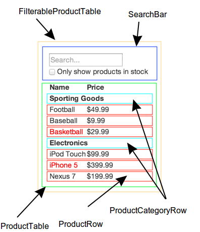

Theo quan điểm của chúng tôi, React cung cấp một giải pháp thượng hạng để xây dựng một ứng dụng Web vừa lớn, vừa nhanh với JavaScript. Việc sử dụng React cho Facebook và Instagram đã giúp việc mở rộng 2 ứng dụng này rất tốt.

Một trong những phần tuyệt vời nhất của React là việc nó khiến ta nghĩ về ứng dụng khi đang xây dựng nó. Bài viết này sẽ nói về "*quy trình tư duy trong React*" khi tạo một ứng dụng nhỏ: một bảng chứa thông tin sản phẩm (của 1 cửa hàng nào đó), từ đấy khách hàng có thể tìm kiếm và lọc ra thứ mình cần. 

## Bắt đầu với một bản phác thảo

Tưởng tượng chúng ta đã có sẵn 2 thứ sau:
1. Một API trả về JSON, 
2. Một bản phác thảo giao diện của ứng dụng.

Bản phác thảo giao diện trông giống như dưới đây:


Còn API sẽ trả về dữ liệu dạng JSON giống như sau:

```
[
  {category: "Sporting Goods", price: "$49.99", stocked: true, name: "Football"},
  {category: "Sporting Goods", price: "$9.99", stocked: true, name: "Baseball"},
  {category: "Sporting Goods", price: "$29.99", stocked: false, name: "Basketball"},
  {category: "Electronics", price: "$99.99", stocked: true, name: "iPod Touch"},
  {category: "Electronics", price: "$399.99", stocked: false, name: "iPhone 5"},
  {category: "Electronics", price: "$199.99", stocked: true, name: "Nexus 7"}
];
```

## Bước 1: Chia nhỏ phần UI (Giao diện người dùng)

Điều cần làm đầu tiên là khoanh những hình chữ nhật xung quanh các mục con trong bản phác thảo, đặt tên cho từng mục, mỗi mục chính là 1 component của React. Nếu bạn làm việc với một thiết kế đồ họa, thì khả năng cậu ta đã làm việc này, đấy chính là tên layer trong file Photoshop.

Nhưng làm thế nào để biết mỗi component nên có gì bên trong? Hãy áp dụng nguyên lý ["Single Responsibility Principle"](https://en.wikipedia.org/wiki/Single_responsibility_principle), nghĩa là, mỗi một component chỉ làm và làm tốt một việc. Nếu việc này lớn, thì chia nhỏ tiếp thành những component nhỏ hơn.

Bởi bạn thường dùng data model dạng JSON, bạn sẽ thấy nếu dữ liệu được thiết kế chuẩn xác, thì giao diện (và cấu trúc component) cũng sẽ ăn khớp với với phần dữ liệu. Lý do? Bởi UI và data model có xu hướng dùng chung một "kiến trúc thông tin", tức là việc chia giao diện ra thành các components thường không quá quan trọng. Chỉ cần chia nó thành các phần tương ứng với những mục trong mô hình dữ liệu.



Như thấy ở hình trên, ta sẽ có 5 components trong ứng dụng đơn giản này, bao gồm:

  1. **`FilterableProductTable` (màu da cam):** chứa toàn bộ ứng dụng
  2. **`SearchBar` (xanh nước biển):** nhận phần *nhập liệu của người dùng*
  3. **`ProductTable` (xanh lá cây):** hiển thị và lọc *dữ liệu* dựa trên *những gì người dùng nhập vào*
  4. **`ProductCategoryRow` (xanh ngọc lam):** hiển thị tiêu đề cho mỗi *mục*
  5. **`ProductRow` (màu đỏ):** hiển thị mỗi *sản phẩm* trong 1 dòng

```js
FilterableProductTable
  |
  +-----SearchBar
  |
  +-----ProductTable
            |
            |---ProductCategoryRow
            |
            +---ProductRow   
```

Khi nhìn vào `ProductTable`, bạn sẽ thế phần tiêu đề của bảng (chứa mục "Name" và "Price")không được cho vào 1 component riêng. Đây đơn thuần là sở thích riêng, và có những người muốn tạo component. For this example, we left it as part of `ProductTable` because it is part of rendering the *data collection* which is `ProductTable`'s responsibility. However, if this header grows to be complex (i.e. if we were to add affordances for sorting), it would certainly make sense to make this its own `ProductTableHeader` component.

Sau khi đã xác định được các components trong bản phác thảo, việc cần làm tiếp là sắp xếp components đó vào trong 1 một cấu trúc hình cây. Việc này thì đơn giản, component nào xuất hiện bên trong component khác trong bản phác thảo, thì sẽ là component "con" trong cấu trúc hình cây:

  * `FilterableProductTable`
    * `SearchBar`
    * `ProductTable`
      * `ProductCategoryRow`
      * `ProductRow`

## Bước 2: Xây dựng một phiên bản tĩnh cho ứng dụng trong React

<p data-height="600" data-theme-id="0" data-slug-hash="BwWzwm" data-default-tab="js" data-user="lacker" data-embed-version="2" class="codepen">Xem code mẫu <a href="https://codepen.io/gaearon/pen/BwWzwm">Tư duy trong React: Bước 2</a> ở <a href="http://codepen.io">CodePen</a>.</p>
<script async src="https://production-assets.codepen.io/assets/embed/ei.js"></script>

Sau khi đã có danh sách các component dạng cấu trúc hình cây, giờ là lúc bắt tay vào code. Cách dễ nhất là xây dựng một phiên bản có thể nhận dữ liệu và render ra UI nhưng không có bất kỳ tương tác nào. Tốt nhất là tách rời các quá trình này bởi một phiên bản "tĩnh" cần gõ rất nhiều mà không cần nghĩ, trong khi thêm tính tương tác sẽ đòi hỏi nghĩ nhiều mà không gõ mấy. Ta sẽ xem lý do tại sao.

Để xây một phiên bản tĩnh của ứng dụng có thể render từ dữ liệu, bạn sẽ muốn tạo các component có thể tái sử dụng từ các component khác, và truyền dữ liệu thông qua *props*. *props* là một cách để truyền dữ liệu từ cấp trên xuống cấp dưới. Nếu bạn đã quen với *state*, **hãy đừng dùng bất kỳ state nào** trong lúc làm phiên bản tĩnh. State chỉ dành cho các tính năng tương tác, tức là khi dữ liệu có thay đổi qua thời gian. Vì đây chỉ là phiên bản tĩnh nên bạn sẽ không cần đến nó.

Bạn có thể xây từ trên xuống, hoặc từ dưới lên. Nghĩa là, bạn có thể bắt đầu code với component ở cấp cao nhất trong danh sách (trong ví dụ này là `FilterableProductTable`) hoặc thấp nhất (chính là `ProductRow`). Trong các bài toán đơn giản, sẽ dễ hơn khi đi từ trên xuống, còn với dự án lớn, sẽ dễ hơn khi đi từ dưới lên và viết test cho từng component.

Khi kết thúc bước này, bạn sẽ có một thư viện chứa các components có thể tái sử dụng, dùng vào việc render UI từ dữ liệu truyền vào. Các components sẽ chỉ có method `render()` bởi đây là phiên bản tĩnh. Component ở cấp cao nhất (`FilterableProductTable`) sẽ nhận dữ liệu truyền vào dưới dạng prop. Nếu có thay đổi với dữ liệu, gọi lại hàm `ReactDOM.render()`, và rồi giao diện sẽ được cập nhật. Rất dễ để quan sát cách UI được cập nhật, và nơi để tạo ra sự thay đổi bởi không có gì phức tạp. React có **luồng dữ liệu 1 chiều** (còn gọi là *one-way binding*) giúp mọi thứ gọn ghẽ và chạy nhanh.

### Giai lao giữa giờ: Props so với State

Có hai dạng "data model" trong React: props và state. Việc hiểu rõ sự khác biệt giữa hai mô hình này vô cùng quan trọng; hãy đọc lại [tài liệu chính thức của React](/docs/interactivity-and-dynamic-uis.html) nếu bạn không chắc chắn hai mô hình này khác nhau ở đâu.

## Bước 3: Xác định  The Minimal (but complete) Representation Of UI State

Để tạo ra sự tương tác cho trang web, ta cần có khả năng lan truyền những thay đổi đến tầng data model bên dưới. React giúp làm việc này dễ dàng với **state**.

Trong khi tạo ứng dụng, ta cần nghĩ là ứng dụng sẽ cần thay đổi những state nào, và cố gắng sao cho số state ấy là tối thiểu. Điểm mấu chốt ở đây là: [DRY: *Don't Repeat Yourself*](https://en.wikipedia.org/wiki/Don%27t_repeat_yourself). Figure out the absolute minimal representation of the state your application needs and compute everything else you need on-demand. For example, if you're building a TODO list, just keep an array of the TODO items around; don't keep a separate state variable for the count. Instead, when you want to render the TODO count, simply take the length of the TODO items array.

Với ứng dụng đang làm ở các bước trên, các "mảnh dữ liệu" mà ta cần tính đến là: 
  * Danh sách gốc chứa các sản phẩm
  * Đoạn text mà user nhập vào để tìm kiếm
  * Giá trị của checkbox
  * Danh sách đã được lọc chứa các sản phẩm

Ta cần đi qua từng dữ liệu, quyết định xem cái nào là state nhờ 3 câu hỏi sau:

  1. Dữ liệu này có được truyền xuống từ component cha thông qua props? Nếu đúng, thì đây không phải là state..
  2. Dữ liệu này trước sau không đổi? Nếu đúng, vậy thì đây không phải là state.
  3. Dữ liệu này có thể tính dựa vào state khác hoặc props trong component? Nếu đúng, đây không phải là state.

Đối chiếu với dữ liệu trên, ta có bảng sau:

|#  |Dữ liệu | Được truyền từ cha? | Trước sau không đổi? | Tính dựa vào state / prop khác? 
|---|---      |---                |---                    |---                              |
|1 | Danh sách sản phẩm gốc | Đúng  |-                    |-                                |
|2  | Text user nhập vào ô tìm kiếm | Không | Không | Không |
|3  | Giá trị checkbox  | Không | Không | Không |
|4  | Danh sách sản phẩm đã được lọc  | Không | Không | Đúng |

Ghi chú: Danh sánh sản phẩm đã được lọc có thể tính nhờ vào 3 dữ liệu trên.

Như vậy, danh sách state bao gồm:

  * Đoạn text mà người dùng nhập vào để tìm kiếm
  * Giá trị của ô checkbox

## Bước 4: Xác định nơi chứa State

<p data-height="600" data-theme-id="0" data-slug-hash="qPrNQZ" data-default-tab="js" data-user="lacker" data-embed-version="2" class="codepen">See the Pen <a href="https://codepen.io/gaearon/pen/qPrNQZ">Thinking In React: Step 4</a> on <a href="http://codepen.io">CodePen</a>.</p>

OK, ta đã có được danh sách (tối thiểu) của state trong app. Giờ phải xác định xem component nào sẽ cần những state này.

Lưu ý: React hoàn toàn chỉ có luồng dữ liệu một chiều chảy theo các nhánh của cây component. Và không dễ để xác định xem component nào cần state nào. **Đây thường là thử thách lớn nhất với người mới,** vì thế để hiểu, hãy làm theo các bước sau:

Đối với mỗi state trong ứng dụng:

  * Kiểm tra tất các component, nhưng cái nào render thứ gì đó dựa trên state.
  * Tìm một component chung (component này cần state, và đứng trên những component còn lại trong cây cấu trúc component).  
  * Hoặc là component sở hữu state, hoặc component cao hơn nó một bậc.
  * Nếu không thể tìm thất một component nào hợp lý để sở hữu state, hãy tạo 1 component mới chỉ để chứa state, và đặt nó chỗ nào đấy phía trên component sở hữu.

Áp dụng điều trên vào app đang làm:

  * `ProductTable` cần lọc danh sách sản phẩm dựa vào state, và `SearchBar` cần hiển thị ô tìm kiếm và trạng thái của checkbox.
  * Component sở hữu chung là `FilterableProductTable`.
  * State "text tìm kiếm" và "giá trị của ô checkobx" thuộc về `FilterableProductTable` có vẻ hợp lý.

Chuẩn, vậy ta quyết định state sẽ nằm trong `FilterableProductTable`.
- Đầu tiên, thêm 1 instance property `this.state = {filterText: '', inStockOnly: false}` vào constructor của  `FilterableProductTable` để thiết lập giá trị ban đầu của state của ứng dụng. 
- Sau đó, truyền `filterText` và `inStockOnly` vào `ProductTable` và `SearchBar` như props. 
- Cuối cùng, sử dụng những props này để lọc hàng trong `ProductTable`, và điền giá trị và các filed trong form của `SearchBar`.

Giờ ta có thể bắt đầu thấy cách mà ứng dụng sẽ làm việc: điền `"ball"` vào `filterText`, rồi refresh app, bảng dữ liệu sẽ được cập nhật, chỉ chứa những sản phẩm có chữ "ball".

## Step 5: Add Inverse Data Flow

<p data-height="600" data-theme-id="0" data-slug-hash="LzWZvb" data-default-tab="js,result" data-user="rohan10" data-embed-version="2" data-pen-title="Thinking In React: Step 5" class="codepen">See the Pen <a href="https://codepen.io/gaearon/pen/LzWZvb">Thinking In React: Step 5</a> on <a href="http://codepen.io">CodePen</a>.</p>

```js
FilterableProductTable
  |
  +-----SearchBar
  |
  +-----ProductTable
            |
            |---ProductCategoryRow
            |
            +---ProductRow   
```

Cho đến giờ, ta đã dựng một ứng dụng có các components được render như những hàm nhận props và state theo luồng từ trên xuống dưới. Lúc này cần nghĩ đến việc làm sao để dữ liệu có thể chảy theo luồng dữ lại: component từ bên dưới của cây cấu trúc có thể cập nhật trạng thái ở `FilterableProductTable`.

Cách làm của React làm cho luồng dữ liệu trở nên tường minh, lập trình viên có thể hiểu dễ dàng hơn cách chương trình làm việc, nhưng nó cần viết nhiều code hơn một chút so với phương pháp truyền thống "2-way data binding".

Ở phiên bản hiện tại, React sẽ bỏ qua những gì bạn gõ và ô Tìm kiếm, hoặc tích vào ô checkbox. Điều này hoàn toàn chủ ý, bởi chúng tôi đã để prop `value` của `input` luôn bằng với `state` được truyền xuống từ `FilterableProductTable`.

Hãy cùng nghĩ về những gì chúng ta muốn chương trình hoạt động. Ta muốn đảm bảo bất kỳ lúc nào người dùng thay đổi form, ta sẽ cập nhật state theo đúng những gì nhập vào form. Bở component chỉ nên cập nhất state của chính nó, `FilterableProductTable` sẽ truyền callback đến `SearchBar`, component này sẽ  that will fire whenever the state should be updated. We can use the `onChange` event on the inputs to be notified of it. The callbacks passed by `FilterableProductTable` will call `setState()`, and the app will be updated.

Though this sounds complex, it's really just a few lines of code. And it's really explicit how your data is flowing throughout the app.

## And That's It

Hy vọng là bài viết này đã cho bạn vài ý tưởng về cách tư duy, làm thế nào để dựng component và ứng dụng trong React. Dẫu code viết ra trông có vẻ dài dòng (hơn những gì bạn vẫn thường làm), thì hãy nhớ là ta đọc code nhiều hơn viết code rất nhiều. Và code viết một cách tường minh, theo module, sẽ khiến cho việc đọc code dễ dàng hơn. Một khi bạn bắt đầu xây dựng những thư viện lớn với nhiều component, bạn sẽ thấy trân trọng tính module và sự tường minh nói trên; với việc tái sử dụng code, số dòng code của bạn sẽ bắt đầu ít đi.